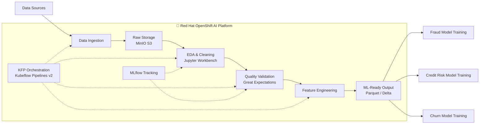

# 🏦 OpenShift AI — Retail Banking Data Preparation POC

[](https://www.redhat.com/en/technologies/cloud-computing/openshift/openshift-ai)
[](https://www.kubeflow.org/)
[](https://python.org)
[](https://greatexpectations.io)
[](https://mlflow.org)
[](https://min.io)
[](LICENSE)

> An MLOps proof of concept demonstrating end-to-end **data preparation pipeline design** for retail banking machine learning use cases on Red Hat OpenShift AI (RHOAI).

---

## 🎯 Project Overview

This repository documents **Sprint 1** of a production-grade data preparation framework. The goal is to validate that OpenShift AI can serve as the MLOps platform for building, orchestrating, and governing data pipelines for retail banking ML models — before any model training begins.

The POC deliberately separates **data preparation** from **model development**, treating clean, validated, ML-ready feature datasets as the primary deliverable of this phase.

---

## 📋 Use Cases in Scope

| Use Case | Target | Data Source | Key Challenge |
|---|---|---|---|
| 🔍 Fraud & AML Detection | Binary classification | Transaction-level events | Severe class imbalance (~1–2% fraud rate) |
| 📊 Credit Risk Scoring | Default probability | Customer + loan history | Multi-table joins, delinquency staging |
| 📉 Customer Churn Prediction | Churn probability | Account activity + products | Churn definition window, engagement signals |

---

## 🏗️ Architecture



### Pipeline Phases

| Phase | Tool | Input | Output |
|---|---|---|---|
| **1. Ingestion** | boto3 / MinIO | CSV, Parquet, API | Raw bucket |
| **2. EDA & Profiling** | pandas, ydata-profiling | Raw data | Profile report |
| **3. Cleaning & Transform** | pandas, PySpark | Raw data | Clean dataset |
| **4. Quality Validation** | Great Expectations | Clean dataset | Validated + report |
| **5. Feature Engineering** | scikit-learn, pandas | Validated data | Feature dataset (Parquet) |

---

## 🗂️ Repository Structure

```
openshift-ai-data-prep-poc/
│
├── 📋 sprint/                         # Sprint documentation
│   ├── sprint_01_goals.md             # Current sprint goals & status
│   ├── sprint_02_preview.md           # Upcoming sprint preview
│   └── definition_of_done.md         # DoD for all pipeline work
│
├── 📖 docs/                           # Technical documentation
│   ├── architecture.md               # Detailed architecture decisions
│   ├── use_cases.md                  # Use case specifications
│   ├── data_strategy.md             # Dataset sourcing & synthetic data
│   └── environment_checklist.md     # RHOAI setup verification
│
├── 🐍 src/                            # Source code
│   ├── config.py                     # Central configuration
│   ├── data_generation/              # Synthetic data generators
│   │   ├── customers.py              # Customer profile generator
│   │   └── transactions.py          # Transaction event generator
│   ├── ingestion/
│   │   └── minio_client.py          # S3/MinIO utilities
│   ├── pipeline/
│   │   ├── components.py            # KFP v2 components
│   │   └── banking_pipeline.py      # Pipeline definition
│   └── validation/
│       └── expectation_suites.py    # Great Expectations suites
│
├── 📜 scripts/
│   ├── verify_rhoai_env.sh          # One-shot environment checker
│   └── bootstrap_buckets.sh         # MinIO bucket setup
│
├── 📓 notebooks/
│   └── 01_eda_template.py           # EDA exploration template
│
├── requirements.txt
└── requirements-dev.txt
```

---

## 🚀 Quick Start

### Prerequisites

- Python 3.9+
- Access to a Red Hat OpenShift AI 2.x cluster
- MinIO or S3-compatible object storage
- Kubeflow Pipelines v2 (DSPA provisioned in your namespace)

### 1. Clone & Install

```bash
git clone https://github.com/<your-username>/openshift-ai-data-prep-poc.git
cd openshift-ai-data-prep-poc
pip install -r requirements.txt
```

### 2. Configure Environment

```bash
export MINIO_ENDPOINT="http://minio.<your-namespace>.svc:9000"
export AWS_ACCESS_KEY_ID="your-minio-key"
export AWS_SECRET_ACCESS_KEY="your-minio-secret"
export MLFLOW_TRACKING_URI="http://mlflow.<your-namespace>.svc:5000"
export KFP_ENDPOINT="https://ds-pipeline-dspa.<your-namespace>.svc:8443"
```

### 3. Verify RHOAI Environment

```bash
chmod +x scripts/verify_rhoai_env.sh
./scripts/verify_rhoai_env.sh --namespace <your-namespace>
```

### 4. Generate Synthetic Data

```bash
python -m src.data_generation.customers --output-bucket poc-raw --records 500000
python -m src.data_generation.transactions --output-bucket poc-raw --records 2000000
```

### 5. Run the Pipeline

```python
from src.pipeline.banking_pipeline import compile_and_run

compile_and_run(
    kfp_endpoint="https://ds-pipeline-dspa.<namespace>.svc:8443",
    use_case="fraud",
    n_records=500000
)
```

---

## 📦 Tech Stack

| Layer | Technology |
|---|---|
| ML Platform | Red Hat OpenShift AI (RHOAI) 2.x |
| Orchestration | Kubeflow Pipelines v2 (KFP SDK 2.x) |
| Storage | MinIO (S3-compatible) / OpenShift Data Foundation |
| Data Processing | pandas, PySpark, scikit-learn |
| Data Quality | Great Expectations |
| Experiment Tracking | MLflow |
| Synthetic Data | Faker, SDV, CTGAN |
| Containerization | OpenShift / Kubernetes |

---

## 📊 Open Datasets Used

| Dataset | Use Case | Source | Records |
|---|---|---|---|
| [ULB Credit Card Fraud](https://www.kaggle.com/datasets/mlg-ulb/creditcardfraud) | Fraud Detection | Kaggle | 284,807 |
| [Home Credit Default Risk](https://www.kaggle.com/competitions/home-credit-default-risk) | Credit Risk | Kaggle | 300K+ |
| [Bank Marketing UCI](https://archive.ics.uci.edu/dataset/222/bank+marketing) | Customer Churn | UCI ML Repo | 41,188 |

---

## 🔒 Data Privacy

This repository contains **no real customer data**. All data used in this POC is either:
- Publicly available benchmark datasets (fully anonymized at source)
- Synthetically generated using Faker and SDV libraries

---

## 📅 Sprint Status

**Current Sprint:** Sprint 1 — Design & Validation  
**Status:** ✅ Architecture designed | ✅ Data strategy defined | 🔄 Environment verification pending

See [`sprint/sprint_01_goals.md`](sprint/sprint_01_goals.md) for full details.

---

## 🤝 Contributing

This is an internal MLOps POC. For questions on the architecture or pipeline design, refer to the [`docs/`](docs/) directory.

---

## 📄 License

[MIT](LICENSE)
