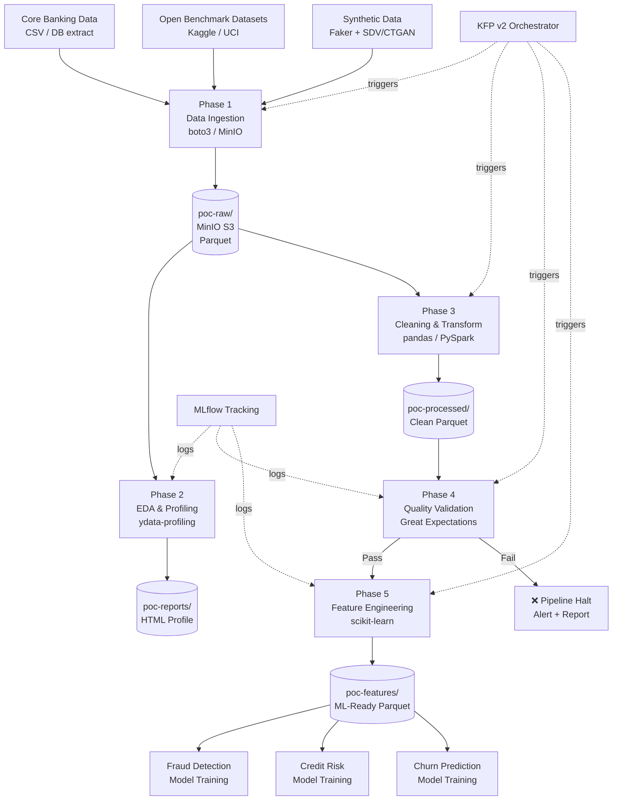

# Architecture

## Overview

The data preparation POC is structured as a five-phase pipeline running entirely inside Red Hat OpenShift AI (RHOAI). The pipeline is orchestrated by Kubeflow Pipelines v2 (via the Data Science Pipelines Application — DSPA), with experiment metadata tracked in MLflow.

---

## Platform Components

```
┌─────────────────────────────────────────────────────────────────┐
│                  Red Hat OpenShift AI Platform                  │
│                                                                 │
│  ┌──────────────┐  ┌──────────────┐  ┌──────────────────────┐  │
│  │   Jupyter    │  │    MinIO /   │  │  Data Science        │  │
│  │  Workbench   │  │  ODF (S3)    │  │  Pipeline (DSPA)     │  │
│  │  (Notebooks) │  │  Storage     │  │  Kubeflow Pipelines  │  │
│  └──────────────┘  └──────────────┘  └──────────────────────┘  │
│                                                                 │
│  ┌──────────────┐  ┌──────────────┐  ┌──────────────────────┐  │
│  │   MLflow     │  │  Container   │  │   RBAC / Namespace   │  │
│  │  Tracking    │  │  Registry    │  │   Resource Quotas    │  │
│  └──────────────┘  └──────────────┘  └──────────────────────┘  │
└─────────────────────────────────────────────────────────────────┘
```

---

## Pipeline Data Flow



---

## Bucket Structure

```
MinIO
├── poc-raw/
│   ├── customers/
│   │   └── v=1/date=2025-01-01/customers.parquet
│   └── transactions/
│       └── v=1/date=2025-01-01/transactions.parquet
│
├── poc-processed/
│   ├── customers_clean/
│   └── transactions_clean/
│
├── poc-features/
│   ├── fraud/
│   │   └── v=1/features.parquet
│   ├── credit_risk/
│   │   └── v=1/features.parquet
│   └── churn/
│       └── v=1/features.parquet
│
└── poc-reports/
    ├── profiles/
    └── ge_validations/
```

---

## Design Decisions

### Why MinIO for storage?
MinIO is the default S3-compatible object store bundled with RHOAI (via OpenShift Data Foundation). Using S3-compatible APIs means zero code changes if we migrate to AWS S3 or another object store.

### Why Kubeflow Pipelines v2?
RHOAI ships with a managed KFP v2 server via the DSPA operator. KFP v2 provides: strongly-typed component I/O, artifact lineage, pipeline versioning, and scheduled runs — all without additional infrastructure.

### Why Great Expectations over custom validation?
GE provides a declarative, version-controlled data contract that integrates with MLflow and produces shareable HTML reports. It separates data quality logic from processing logic, making it easier to maintain as schemas evolve.

### Why Parquet for storage format?
Parquet provides: columnar compression (4–10× size reduction), schema enforcement, partition pruning for large datasets, and native support in pandas, PySpark, and DuckDB — all tools in this pipeline.

---

## Resource Profiles

| Workload | CPU Request | CPU Limit | Memory Request | Memory Limit |
|---|---|---|---|---|
| EDA notebook (light) | 1 | 2 | 4Gi | 8Gi |
| Cleaning pipeline (pandas) | 2 | 4 | 8Gi | 16Gi |
| Feature engineering (PySpark) | 4 | 8 | 16Gi | 32Gi |
| GE validation | 1 | 2 | 2Gi | 4Gi |
