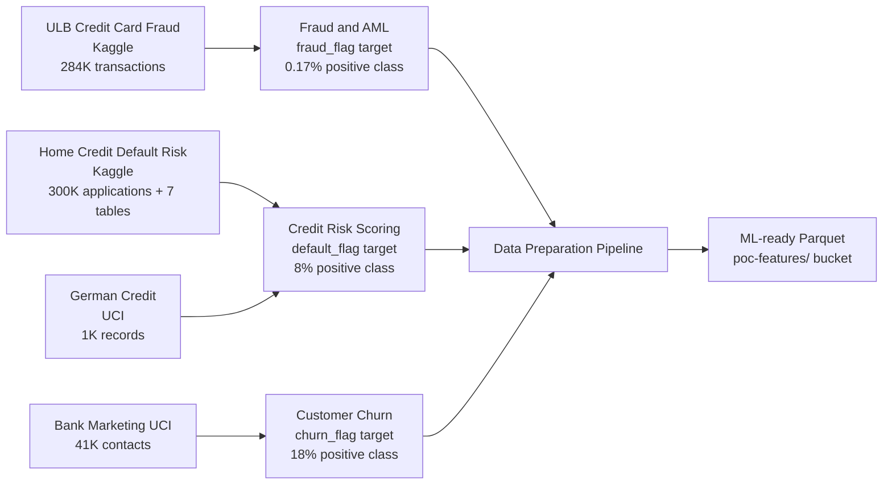

# Data Strategy

## Overview

Since production data cannot be used in a POC environment, the data strategy combines three tracks to produce realistic, ML-representative datasets without exposing any real customer information.

---


## Dataset to Use Case Mapping



---

## Track 1 Open Benchmark Datasets

Public datasets that map directly to each use case and serve as ground truth for pipeline validation.

### Fraud Detection
**Dataset:** ULB Credit Card Fraud Detection 
**Source:** [Kaggle](https://www.kaggle.com/datasets/mlg-ulb/creditcardfraud) 
**Size:** 284,807 transactions 
**Fraud rate:** 0.172% (492 fraud cases) 
**Features:** 28 PCA-anonymized numerical features + Amount + Time 
**Why this dataset:** Industry-standard fraud benchmark. Demonstrates class imbalance handling, feature scaling on skewed distributions, and threshold calibration.

### Credit Risk Scoring
**Dataset:** Home Credit Default Risk 
**Source:** [Kaggle](https://www.kaggle.com/competitions/home-credit-default-risk) 
**Size:** 300K+ applications across 7 relational tables 
**Default rate:** ~8% 
**Why this dataset:** Most realistic public credit risk dataset available. Multi-table join requirement mimics real bank data warehouse structure.

**Secondary:** UCI Default of Credit Card Clients 
**Source:** [UCI ML Repository](https://archive.ics.uci.edu/dataset/350/default+of+credit+card+clients) 
**Size:** 30,000 records 
**Why:** Single flat table, fast iteration, good for baseline pipeline testing.

### Customer Churn
**Dataset:** Bank Marketing Dataset 
**Source:** [UCI ML Repository](https://archive.ics.uci.edu/dataset/222/bank+marketing) 
**Size:** 41,188 contacts 
**Features:** 20 features including macroeconomic indicators, contact patterns, customer attributes 
**Why this dataset:** Most banking-authentic public churn proxy available. Mixes feature types, includes temporal and economic context.

---

## Track 2 Synthetic Data Generation

500,000 records generated programmatically to match the schema and statistical properties of real bank data, using information gathered from the data scientist.

### Libraries

| Library | Role |
|---|---|
| `Faker` | Realistic names, IDs, dates, addresses with locale support |
| `SDV` | Statistical distribution modeling and sampling |
| `CTGAN` | Conditional Tabular GAN preserves column correlations |

### Schema Sources

The synthetic generator is parameterized to accept:
- Column names and data types (from data scientist questionnaire)
- Value ranges (min/max for numerical, value set for categorical)
- Null rates per column
- Target class rate (fraud rate, default rate, churn rate)
- Inter-column correlation structure

### Fidelity Approach

```
Real data statistics
 │
 ▼
Schema questionnaire (15 questions data scientist)
 │
 ▼
Statistical profile (means, stds, skewness, correlations)
 │
 ▼
CTGAN training on open dataset sample
 │
 ▼
Synthetic data with matching statistical properties
```

---

## Track 3 Simulated Core Banking Schema

Even without real data, we define and populate the exact table schema expected in production. This lets us validate ingestion logic and pipeline structure before receiving real or anonymized data.

### Tables Simulated

```sql
CUSTOMER -- demographics, tenure, products
ACCOUNT -- account type, balance, status
TRANSACTION -- channel, amount, merchant, timestamp
LOAN -- type, amount, tenor, delinquency_stage
KYC_STATUS -- verification status, risk tier
```

Relationships:
- CUSTOMER (1) ACCOUNT (many)
- ACCOUNT (1) TRANSACTION (many)
- CUSTOMER (1) LOAN (many)

---

## Data Privacy Guarantees

| Guarantee | How enforced |
|---|---|
| No real customer records | All data is synthetically generated or from public datasets |
| No PII leakage | Faker generates non-real names/IDs; no reverse-engineering possible |
| No real account numbers | Account IDs are UUID-based random identifiers |
| Open dataset licensing | All benchmark datasets used under their respective open licenses |

---

## Volume Targets

| Dataset | Records | Approximate Size |
|---|---|---|
| Customers | 500,000 | ~200 MB (Parquet) |
| Transactions | 2,000,000 | ~800 MB (Parquet) |
| Loans | 200,000 | ~80 MB (Parquet) |
| Accounts | 600,000 | ~120 MB (Parquet) |
| **Total** | **~3.3M** | **~1.2 GB** |
