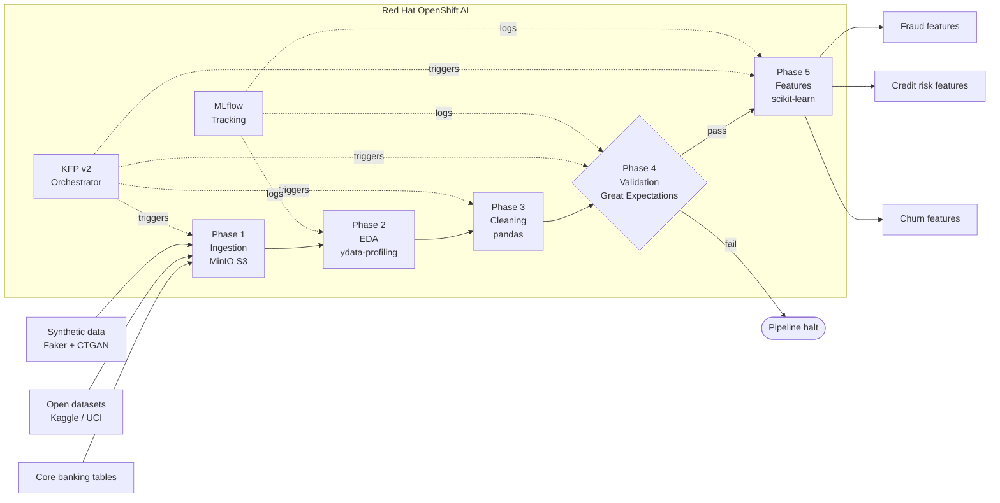
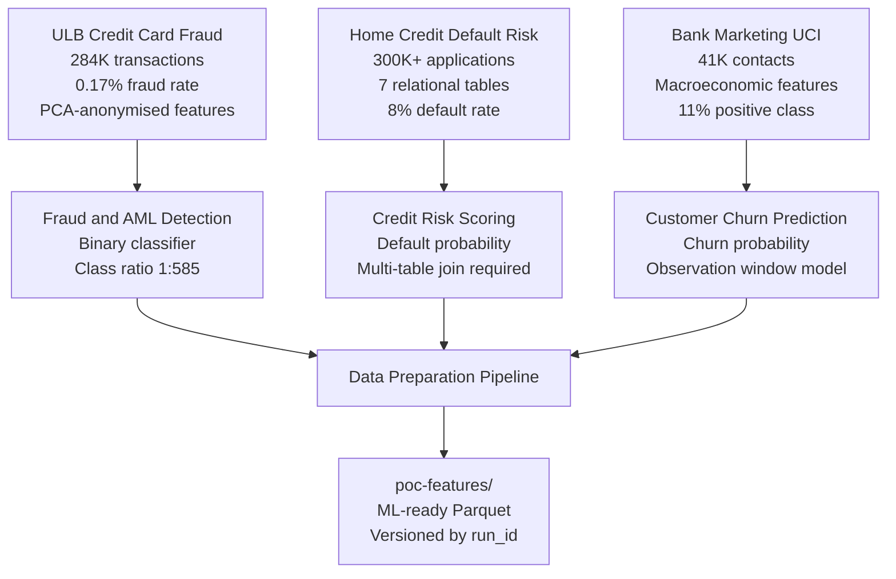
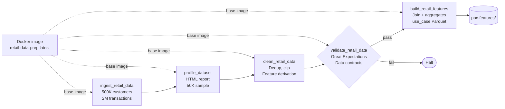
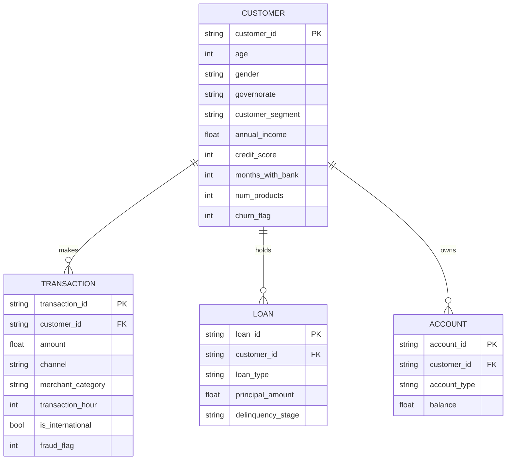

# Sprint 1 — Showcase

This page is designed to be opened during the sprint review call. It covers what was built, the architecture, the data strategy, and what runs today.

Repository: [github.com/iwakiel/openshift-ai-data-prep-poc](https://github.com/iwakiel/openshift-ai-data-prep-poc)

---

## What was delivered

| # | Deliverable | Status | Key artefact |
|---|---|---|---|
| 1 | Five-phase data prep pipeline design | Done | `src/pipeline/` |
| 2 | KFP v2 component implementation (all 5 phases) | Done | `src/pipeline/components.py` |
| 3 | Synthetic retail banking data generators | Done | `src/data_generation/` |
| 4 | MinIO S3 client utilities | Done | `src/ingestion/minio_client.py` |
| 5 | Great Expectations validation suites | Done | `src/validation/expectation_suites.py` |
| 6 | Dockerfile for pipeline component image | Done | `Dockerfile` |
| 7 | Python package setup (installable) | Done | `pyproject.toml` |
| 8 | RHOAI environment verification script | Done | `scripts/verify_rhoai_env.sh` |
| 9 | Open dataset mapping to retail use cases | Done | `docs/data_strategy.md` |
| 10 | Schema questionnaire sent to data scientist | Done | 15 questions, awaiting response |

---

## Pipeline architecture



---

## Retail banking use cases in scope



---

## KFP pipeline component chain

Five components execute in sequence inside a Kubeflow Pipelines v2 run. Each reads from and writes to MinIO S3. The validation component raises a `RuntimeError` on any expectation failure — the pipeline halts rather than propagating bad data.



---

## Retail banking data model

The synthetic data generators produce four linked tables. The feature engineering component joins customers with aggregated transaction metrics.



---

## S3 bucket layout

```
MinIO
├── poc-raw/
│   ├── customers/run_id=001/customers.parquet      (500K rows)
│   └── transactions/run_id=001/transactions.parquet (2M rows)
│
├── poc-processed/
│   ├── customers_clean/run_id=001/customers_clean.parquet
│   └── transactions_clean/run_id=001/transactions_clean.parquet
│
├── poc-features/
│   ├── fraud/run_id=001/features.parquet
│   ├── credit_risk/run_id=001/features.parquet
│   └── churn/run_id=001/features.parquet
│
└── poc-reports/
    ├── eda/run_id=001/customers_profile.html
    └── ge/run_id=001/retail_banking.customers.v1.json
```

---

## What runs locally today

No OpenShift cluster needed. Three commands:

```bash
# 1. Install the package
pip install -e ".[pipeline]"

# 2. Generate 500K synthetic retail banking customers
python -m src.data_generation.customers --local-only --records 500000

# 3. Generate 2M linked transactions
python -m src.data_generation.transactions \
    --customers-path /tmp/customers.parquet \
    --local-only \
    --records 2000000
```

---

## What requires the cluster

| Step | What is needed | Action |
|---|---|---|
| Build pipeline image | Docker + OpenShift image registry | `make build-image push-image` |
| Submit KFP run | DSPA provisioned in namespace | `make compile-pipeline` then upload YAML in RHOAI dashboard |
| MLflow tracking | MLflow server deployed | Platform team deployment |

---

## Sprint 2 objectives

| Objective | Description |
|---|---|
| Unblock environment | Run the 7-step verification script, resolve DSPA and MinIO blockers with platform team |
| Schema alignment | Receive data scientist response, update generator configs with real column names and class rates |
| First pipeline run | Ingestion to MinIO, cleaning, GE validation suite passing on RHOAI cluster |
